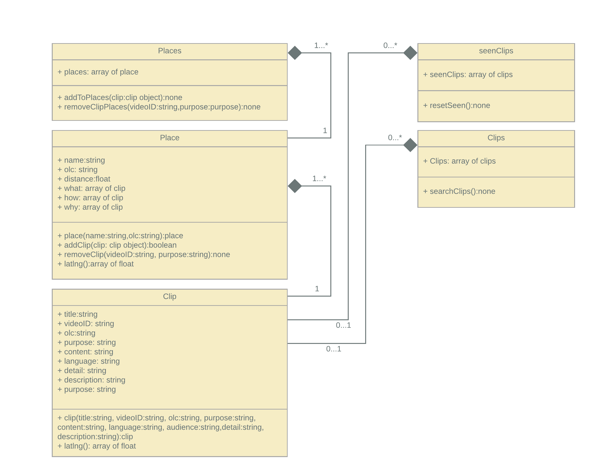

# Relazione Ingegneria del software
Relazione dell'esperienza fatta sviluppando un progetto software con un sistema per lo sviluppo agile in team per il corso di Ingegneria del Software 2019/2020.
dia
**Team:**

* Filippo Bartolucci  0000838531
* Umberto Case  0000833051
* Matteo Celani  0000834303    
* Francesco Cerio 0000832618

.

# Indice
  1. [Progetto Sviluppato](#progettosviluppato)  
    1.1 [Tecnologie Utilizzate](#tecnologieutilizzate)  
    1.2 [Software Utilizzati](#softwareutilizzati)  
    1.3 [Divisione compiti](#divisionecompiti)
  2. [Taiga](#taiga)  
    2.1 [Specifiche del progetto](#specificheprogetto)  
    2.2 [Oganizzazione User Story](#organizzazioneuserstory)  
    2.3 [Product Backlog](#productbacklog)  
    2.4 [Organizzazione Kanban](#organizzazionekanban)  
    2.5 [Definition of Done](#definitionofdone)    
    2.6 [Issue](#issue)  
    2.7 [Sprint](#sprint)    
    2.8 [Primo Sprint](#primosprint)   
    2.9 [Secondo Sprint](#secondosprint)  
    2.10 [Terzo Sprint](#terzosprint)  
    2.11 [Quarto Sprint](#quartosprint)  
    2.12 [Burndown](#burndown)
  3. [Gitlab](#gitlab)
  4. [Mattermost](#mattermost)
  5. [Sonarqube](#sonarqube)  
    5.1 [Analisi Primo Sprint](#analisi-primo-sprint)  
    5.2 [Analisi Secondo e Terzo Sprint](#analisi-secondo-sprint)  
    5.4 [Analisi Quarto Sprint](#analisi-quarto-sprint)  
  6. [Innometrics](#innometrics)  
    6.1  [Collector](#collector)  
    6.2  [Transfer](#transfer)
  7. [Commenti Finali](#commentifinali)

## 1. Progetto Sviluppato 
**Where MI? L'audioguida turistica del XXI secolo**
<figure>
   
</figure>

Where MI è una web app che fornisce un modo semplice e veloce per trovare audio guide sul web.

È pensata per due tipi di utenti:
* Le guide, degli influencer/vlogger che posteranno gratuitamente video guide sul web
* I turisti, in cerca di consigli, cultura e svago.

È composta da una coppia di web application:
* Il browser permette ad un turista di scoprire annotazioni audio o testuali sui punti di interesse presso cui si trova e leggerle a schermo oppure sentire una voce sintetica o umana pronunciarle in un auricolare. Le annotazioni sono divise in tre categorie in base allo scopo per il quale sono state registrate le clip:
  * **What**: l'identità del luogo in questione;
  * **Why**: perché è interessante visitare il punto d'interesse;
  * **How**: clip che forniscono informazioni su come accedere ad un luogo;
* L'editor permette ad una guida di creare annotazioni audio oppure testuali, associarle a locazioni georeferenziate, taggarle secondo numerose caratteristiche e caricarle su un server (nel nostro caso Youtube) che possa essere usato da turisti che visitano quei luoghi di interesse.
<figure>
   
   <figcaption style="font-style: italic;font-style: italic;text-align: center;">Grafico UML dei casi d'uso della web application.</figcaption>
</figure>

## Diagramma casi d'uso Browser

| Caso d'uso | Pre-condizioni | Sequenza di Eventi | Errori | Post-condizioni |
|-------------------|---------------------------------------------------------------------------------------------------------------------------------|--------------------------------------------------------------------------------------------------------------------------------------------------------------------------------------------------------------------------------------------------------------------------------------------------------------------------------------------------------------------------------------------------------------------------------------------------------------------------------------------------------------------------|-----------------------------------------------------------------------------------------------------------------------------------------------------------------------------------|---------------------------------------------------------------------------------------------------------------------------------------------------------------------------------------------|
| GeoLocalizzazione | GPS Attivo | - Cliccare sull'apposito pulsante "La mia posizione"  per geolocalizzare la posizione dell'utente. | Se GPS non attivo,  non restituirà alcun risultato. | La posizione rilevata viene passata al Set Posizione,  comparirà sulla mappa il marker  relativo alla posizione dell'Utente. |
| Posizione Manuale | Nessuna | - Tramite il Drag&Drop si può selezionare  una posizione a piacimento sulla mappa. - Tramite la barra di ricerca si potrà definire  la posizione tramite la ricerca per indirizzo. || La posizione rilevata viene  passata al Set Posizione,  comparirà sulla mappa il marker  relativo alla posizione dell'Utente.|
| Set Posizione | GeoLocalizzazione e/o Posizione Manuale deve essere specificata. | Una volta selezionata la modalità con cui  rilevare la posizione il marker relativo alla  posizione dell'utente genererà l'OLC (Open Location Code)  relativo alla posizione, indispensabile per la ricerca delle Clip.|| Viene attivata la  ricerca delle Clip nelle vicinanze tramite l'OLC generato dal SetPosizione. |
| Ricerca Clip | Set Posizione deve aver definito la posizione. | - Automaticamente, dopo aver definito la posizione, sulla mappa compariranno  tutte le clip esistenti  in un certo raggio di distanza  dalla posizione rilevata. | - Superato limite d'utilizzo giornaliero YouTube API Key - Nella posizione rilevata non  sono presenti Clip - Formato URL Clip diverso dal formato richiesto dalla nostra WebApp. | - Viene ordinata, in base alla distanza, la playlist di clip riproducibile tramite il relativo player Audio. - Viene riempita la sezione  Vicino A Me, con le clip nelle strette vicinanze.|
| Player | - Ricerca Clip deve aver trovato almeno una clip - L'utente deve attivare  il microfono per poter  utilizzare i comandi vocali. | - Cliccando sul pulsante Play, oppure tramite il comando vocale "Where Am I" viene  riprodotta la clip relativa al Luogo d'interesse più vicino alla posizione dell'utente. - Le clip vengono riprodotte con uno specifico  ordine, basato sulla Purpose : la prima clip riprodotta sarà il What, successivamente il Why e infine il How. - E' possibile mettere in pausa la riproduzione tramite l'apposito pulsante Pause; è possibile  riprodurre la clip successiva/precedente tramite il pulsante forward/backward. |||
| Filtraggio Clip | I campi che l'utente vuole filtrare devono essere  specificati, tramite le apposite checkBox | - L'utente accede alla sezione nel menù "Filtra Clip" - Seleziona le checkBox relative ai campi che vuole  che siano presenti nei risultati, e sono divisi per : Purpose, Audience e Language - Seleziona il raggio di distanza delle clip che vuole siano mostrate. || All'interno della stessa pagina verranno mostrate solamente le Clip che soddisferanno i filtri precedentemente selezionati.|
| Vicino A Me | Ricerca Clip deve aver trovato almeno una Clip nel raggio dell' OLC  individuato dalla Posizione. | Accedere tramite il menù all'apposita sezione  "Vicino A Me"|| All'interno della sezione verranno visualizzati tutte le Clip relative ai punti d'interesse nelle strette vicinanze, con la possibilità di  riprodurre la Clip che si vuole.|

## Diagramma casi d'uso Editor

| Caso d'uso | Pre-condizioni | Sequenza di Eventi | Errori | Post-condizioni |
|-------------------|---------------------------------------------------------------------------------------------------------------------------------|--------------------------------------------------------------------------------------------------------------------------------------------------------------------------------------------------------------------------------------------------------------------------------------------------------------------------------------------------------------------------------------------------------------------------------------------------------------------------------------------------------------------------|-----------------------------------------------------------------------------------------------------------------------------------------------------------------------------------|---------------------------------------------------------------------------------------------------------------------------------------------------------------------------------------------|
| CLogin Google | Disporre di un Account Google | L'utente effettua il login tramite il suo Account Google | Se non si effettua il login non si può accedere alla sezione di Editor. | L'utente può accedere alla sezione di Editor |
| Inserire la posizione | <ul><li>GPS Attivo</li><li>L'utente deve essere loggato</li></ul> | L'Editor rileva automaticamente la posizione tramite il GPS. Se l'utente vuole cambiare la posizione deve spostare il marker presente sulla mappa nel Browser. | | La posizione rilevata serve per generare un codice OLC inerente alla clip registrata per il luogo in questione. |
| Aggiungere info luogo | L'utente deve essere loggato | L'utente può inserire le informazioni relative al luogo quali: <ul><li>Nome; </li><li>Scopo, selezionando uno dei tre valori tra WHAT, WHY, HOW; </li><li>Lingua; </li><li>Categoria; </li><li>Pubblico; </li><li>Aggiungere una breve descrizione che comparirà successivamente nella descrizione del video su YouTube.</li></ul> || Viene generata una stringa utilizzata come titolo del video che contiene tutte le informazioni necessarie per la ricerca dell'OLC.|
| Upload Clip video | <ul><li>L'utente deve essere loggato</li><li>I campi delle informazioni ed il video non devono essere nulli.</li></ul> | L'utente preme sul pulsante "Carica luogo". | Superato limite d'utilizzo giornaliero YouTube API Key |  Il video e le informazioni relative sono caricati su YouTube rispettando i criteri di ricerca dell'OLC.|
| Registra video | <ul><li>L'utente deve essere loggato</li><li>L'utente deve concedere i permessi al browser per accedere alla fotocamera e al microfono</li></ul> | L'utente può avviare la registrazione ed interromperla manualmente oppure aspettare che finisca automaticamente secondo il tempo prestabilito. || Il video registrato viene salvato. |
| Edit video | <ul><li>L'utente deve essere loggato</li><li>L'utente deve aver registrato un video</li></ul> | L'utente può eliminare il video registrato e registrarne un altro || Il video è salvato localmente in attesa di upload. |
| Crea clip video | <ul><li>Deve essere registrato un video</li><li>L'utente deve essere loggato</li><li>L'utente deve aver inserito le informazioni</li></ul> | L'insieme delle informazioni ed il video vengono raggruppati in un unico file. || Il video è pronto per essere caricato su Youtube. |

## Diagramma di classe
<figure>
    
   <figcaption style="font-style: italic;font-style: italic;text-align: center;"> Strutture dati del browser alla fine del quarto sprint.</figcaption>
</figure>

### 1.1 Tecnologie utilizzate 
Dovendo sviluppare un progetto per il web, i linguaggi da noi usati sono stati HTML, CSS e JavaScript. L'unico vincolo tecnologico dato era che il sito doveva funzionare correttamente su Gocker, una macchina del Dipartimento di Informatica dedicata ai progetti web degli studenti. Gocker offre due servizi: NodeJs per il lato server, obbligatorio, e MongoDB per eventuali database, non obbligatorio.

### 1.2 Software Utilizzati 

#### Filippo Bartolucci  
SO: MacOS Catalina

Come editor per il codice ho scelto di usare [Atom](https://atom.io/) perché molto leggero e allo stesso tempo molto potente grazie alla sua modularità. Installando solo pochi plugin  riesco a ottenere un editor con tutte le funzionalità che mi servono e senza distrazioni inutili.

Per testare localmente il sito ho usato NodeJS da terminale, dato che non avevo grandi necessità oltre a quelle offerte dai moduli di node.

Ho usato [Github Desktop](https://desktop.github.com/) per gestire la repository GitLab attraverso un'interfaccia grafica semplice, che preferisco rispetto alla shell.

#### Umberto Case
SO: MacOs Catalina

Editor utilizzato per lo sviluppo in HTML, JavaScript e CSS: [Atom](https://atom.io/) con le sue estensioni per facilitare la scrittura di codice e debugging.

Software utilizzato per il testing: [MAMP](https://www.mamp.info/en/mamp/mac/) è una collezione di software con cui può essere gestito un server web in locale.

Gestione GitHub: plugin Atom GitHub, per la comodità di utilizzare un solo strumento, facile ed intuitivo, sia per la scrittura di codice sia per le commits nella repository.

#### Francesco Cerio
SO: MacOs Catalina

Per lo sviluppo ho scelto di utilizzare [Atom](https://atom.io/) in quanto, come già scritto in precedenza, è un software versatile e molto potente.

Ho usato [MAMP](https://www.mamp.info/en/mamp/mac/) come server locale per testare il progetto durante lo sviluppo. MAMP è una raccolta di software libero distribuiti insieme per il funzionamento di un server web per siti web dinamici, sul sistema operativo macOS. È semplice, veloce e molto versatile per testare al meglio un sito web prima di caricarlo sul server.

Per gestire la repository GitLab ho utilizzato un plugin Atom che permettesse di collegare la repository in questione e di effettuare le comuni operazioni di Git direttamente dall'editor. Dato che non è molto stabile e spesso causa delle incoerenze tra le versioni dei codici, ho fatto affidamento a [Github Desktop](https://desktop.github.com/) per risolvere i conflitti.

#### Matteo Celani
SO: MacOS Mojave

Ho sviluppato il mio codice su [Atom](https://atom.io/) un editor di testo open source molto potente che supporta la maggior parte dei linguaggi di programmazine, installando pochi plugin sono riuscto ad avere tanti strumenti per lo sviluppo di codice.

Come server in locale ho utilizzato [MAMP](https://www.mamp.info/en/mamp/mac/), esso mi ha permesso di crearmi tutte le directory necessarie per avere un lavoro organizzato e pulito. MAMP è il nome dato ad una precisa collezione di software con cui può essere gestito un web server in locale. Con MAMP gli utenti Mac dispongono di una suite di software che si può installare velocemente e usare facilmente. L'anteprima del lavoro è stata lanciata su [Chrome](https://www.google.com/intl/it/chrome/) che possiede un pannello di sviluppo molto utile: analizzare il sito mentre veniva costruito si è rivelato fondamentale.

Per gestire le repository di GitLab ho utilizzato [Github Desktop](https://desktop.github.com/). Molto semplice da utilizzare, l'interfaccia grafica ti aiuta facilmente a controllare il codice aggiunto o rimosso, in caso di confliti segnala le righe dove si sono verificati, inoltre aggiornare le directory o inviare modifiche è davvero semplice ed intuitivo.

### 1.3 Divisione compiti 
Dato che il progetto si può dividere in due componenti ben separabili, browser ed editor, abbiamo formato due sottoteam:

Team Browser:  
 - Filippo Bartolucci  
 - Umberto Case  

Team Editor:  
 - Francesco Cerio
 - Matteo Celani

## 2. Taiga 

### 2.1 Specifiche del progetto e user story 

Al fine della validità del progetto, abbiamo dovuto rispettare un serie di specifiche date dal docente, senza un formato preciso. Alcune erano facoltative, utili solo ad aumentare il punteggio per progetto.

<figure>
   
   <figcaption style="font-style: italic;font-style: italic;text-align: center;">Esempio di specifiche</figcaption>
</figure>

Per popolare Taiga siamo partiti da queste specifiche per creare le user story, scritte, nella maggioranza dei casi, nel formato SOGGETTO-VERBO-FINE. I possibili soggetti delle nostre user story sono "utente", chi interagisce con la mappa e visualizza le clip, e "editor", chi crea le nuove clip.

<figure>
    
   
   <figcaption style="font-style: italic;font-style: italic;text-align: center;">Trasformazione di una specifica in user story</figcaption>
</figure>

Inizialmente abbiamo riportato tutte le specifiche come user story, comprese quelle facoltative, che poi nel corso dei 4 sprint abbiamo implementato. Alcune di quelle facoltative, per questioni di tempo, non siamo riusciti a portarle a termine.

Il meccanismo di creazione delle story di Taiga è intuitivo e allo stesso tempo funzionale: ci ha permesso di assegnare ad ogni story informazioni secondarie come tag, commenti, related task e status della story.

### 2.2 Organizzazione User Story 
Ad ogni user story abbiamo associato dei tag per facilitare la loro organizzazione. Per esempio, sono stati usati dei tag per differenziare le story facoltative da quelle obbligatorie e tag per le story dell'utente e dall'editor. Sono stati assegnati i punteggi UX/Design/Front/Back e abbiamo utilizzato i commenti per mostrare i progressi nel loro sviluppo.

<figure>
   
   <figcaption style="font-style: italic;text-align: center;">Dettaglio di una user story</figcaption>
</figure>

Per separare meglio le story del browser da quelle dell'editor abbiamo creato una epic user story, che contiene tutte le story più piccole collegate, per entrambe le parti del progetto.

<figure>
   
   <figcaption style="font-style: italic;text-align: center;">Epic user story</figcaption>
</figure>

Avere le user story ben organizzate sul kanban ci ha aiutato molto nello sviluppo. Avendo iniziato a lavorare al progetto durante il periodo delle lezioni, il tempo dedicato allo sviluppo non è stato molto regolare. Tuttavia utilizzando Taiga è stato molto più facile riprendere in breve tempo lo sviluppo dopo periodi di inattività e fare il punto della situazione.

Per la gestione degli issue ci siamo affidati sempre a Taiga perché lo abbiamo trovato più che sufficiente per i nostri scopi, dal momento che per ogni issue permette di assegnare tipo, gravità, priorità e status.

### 2.3 Product Backlog 
Di seguito è riportata l'organizzazione del product backlog diviso tra User Story e stima in ore per la realizzazione di ognuna di esse. La stima è stata effettuata in base alla difficoltà di ciascuna user story ed è un valore indicativo.
<figure>
   
   <figcaption style="font-style: italic;text-align: center;">Product Backlog</figcaption>
</figure>

### 2.4 Organizzazione Kanban 

Di seguito sono riportati degli snapshot effettuati a campione durante lo sviluppo del progetto.

<figure>
   
   <figcaption style="font-style: italic;text-align: center;">Screenshot kanban durante il processo di sviluppo</figcaption>
</figure>

<figure>
   
   <figcaption style="font-style: italic;text-align: center;">Screenshot kanban alla fine del processo di sviluppo</figcaption>
</figure>

Organizzare il Kanban ci ha aiutato ad avere una visione globale dell'avanzamento dello sviluppo del progetto. Visualizzare graficamente i task ci ha permesso di avere un'organizzazione pulita e chiara di tutte le parti da sviluppare e di quelle già completate.

### 2.5 Definition of done 
Il sito per essere funzionante doveva essere compatibile con le clip create dagli altri progetti. Ci siamo basati su questo per la nostra definition of done. Il lato browser doveva trovare e visulizzare senza problemi le clip altrui, d'altra parte il lato editor doveva creare nuove clip e far sì che queste comparissero insieme alle altre.

### 2.6 Issue 
Anche per la gestione degli issue abbiamo utilizzato le funzionalità che ci offre Taiga. Non ha una gestione particolarmente avanzata, però per il nostro progetto è stato più che sufficiente.

<figure>
   
   <figcaption style="font-style: italic;text-align: center;">Issue riportati in Taiga</figcaption>
</figure>

Per ogni issue abbiamo riportato tipo, gravità e priorità, inoltre abbiamo usato il campo descrizione per spiegare il problema. Invece, per aggiungere nuove informazioni sullo stato di un issue abbiamo sfruttato i commenti specifici per issue.

### 2.7 Sprint 

All'inizio dello sviluppo abbiamo deciso che il nostro sito doveva essere sviluppato seguendo lo stile di un'applicazione mobile, quindi doveva essere mobile-first, basato su navbar e reattivo. Per fare ciò abbiamo deciso di usare un footer fisso come navbar e di utilizzare Ajax per il caricamento delle pagine dell'applicazione.

Inizialmente avevamo pianificato 3 sprint, che avrebbero dovuto coprire i 30 giorni prima della consegna. Durante la presentazione del progetto ci è stato chiesto di fare delle modifiche per migliorarlo e riconsegnarlo, per questo abbiamo deciso di organizzare un quarto sprint finale con le modifiche da fare.

Prima di iniziare gli sprint, le uniche righe di codice scritte erano contenute nel file "script.js" e servivano per gestire la navbar e le chiamate ajax.

<figure>
   
   <figcaption style="font-style: italic;font-style: italic;text-align: center;">Resoconto del numero di righe scritte negli sprint </figcaption>
</figure>

#### 2.8 Primo sprint 
Durata: 20/01/2020 - 03/02/2020

Per il primo sprint abbiamo dato priorità assoluta alle user story obbligatorie. Abbiamo inserito tutte le story che ritenevano base per lo sviluppo delle altre. Per esempio sono state inserite le user story che riguardano il login che è una funzionalità necessaria per lo sviluppo delle le user story che riguardano la creazione e il caricamento dei video.

Le uniche cose sviluppate, prima di iniziare gli sprint, erano il tema grafico, la navbar e le relative chiamate ajax per la navigazione delle pagine.

**Risultato sprint**

|    File   	| Righe inizio 	| Righe fine 	| Differenza 	|
|:---------:	|:------------:	|:----------:	|:----------:	|
| script.js 	|      473     	|      0     	|    -473    	|
|  login.js 	|       0      	|     235    	|    +235    	|
|   map.js  	|       0      	|     581    	|    +581    	|
|   Totale  	|      473     	|     581    	|    +108    	|

Alla fine del primo sprint avevamo una versione molto base dell'applicazione. Il file "script.js" è stato diviso in "login.js" e "map.js" per tenere ordinati il codice delle due parti del progetto. Le user story completate con successo sono state le seguenti:

<figure>
   
   <figcaption style="font-style: italic;font-style: italic;text-align: center;">Story realizzate alla fine dello sprint</figcaption>
</figure> 

Il sito è ancora molto semplice: c'è una mappa con qualche pulsante per interagire, le indicazioni stradali per raggiungere i luoghi ed è possibile fare login e vedere le proprie info dalla pagina profilo. I punti di interesse sulla mappa sono stati creati manualmente, in quanto ancora non sviluppato un sistema per la ricerca delle clip. I bug rilevati sono tracciati nella sezione issues Taiga, ma non tutti sono stati risolti: per alcuni c'è un fix da testare, mentre altri non hanno ancora soluzione. Le sezioni "Vicino a me", "Cerca" e "Categorie" sono solo mockup grafici e non sono ancora state sviluppate.

<figure>
   
   <figcaption style="font-style: italic;font-style: italic;text-align: center;">Risultato primo sprint.</figcaption>
</figure> 

#### 2.9 Secondo sprint 
Durata: 03/02/2020 - 09/02/2020

Anche nel secondo sprint le story obbligatorie hanno avuto la priorità, ma abbiamo iniziato  a lavorare anche su qualcuna di quelle facoltative.

<figure>
   
   <figcaption style="font-style: italic;font-style: italic; text-align: center;">Secondo sprint</figcaption>
</figure>

Al termine di questo sprint abbiamo implementato delle feature ulteriori in modo da rendere il sito più completo, esaurendo l'elenco di tutte le richieste obbligatorie. Inoltre, abbiamo iniziato anche a migliorare l'aspetto grafico, rendendolo meno macchinoso e più inuitivo per utente.

**Risultato sprint**  

|    File   	| Righe inizio 	| Righe fine 	| Differenza 	|
|:---------:	|:------------:	|:----------:	|:----------:	|
| editor.js 	|       0      	|     168    	|    +168    	|
|  login.js 	|      235     	|     292    	|     +57    	|
|   map.js  	|      581     	|     807    	|    +226    	|
|   Totale  	|      581     	|     1325   	|    +744    	|

Nella mappa è stata aggiunta la ricerca delle clip, le quali vengono ora visualizzate come luoghi di interesse, nonostante ci sia ancora qualche problema nella lettura dei metadati associati. Sempre sulla mappa è stato aggiunto un player per il controllo della riproduzione delle clip. Per la sezione "Vicino a me" le funzionalità sono rispettate, ma ci sono ancora dei problemi grafici da risolvere. Dal lato Editor è ora possibile registrare video, aggiungere informazioni sul tipo di clip e caricare il tutto su YouTube.

<figure>
   
   <figcaption style="font-style: italic;font-style: italic;text-align: center;">Risultato secondo sprint.</figcaption>
</figure>

#### 2.10 Terzo sprint 
Durata: 09/02/2020 - 13/02/2020

Inizialmente questo era stato programmato per essere lo sprint finale, dato che eravamo giunti a ridosso della data di scadenza per la presentazione del progetto. Ci siamo, quindi concetrati nell'aggiungere alcune delle feature facoltative, nel sistemare i bug e ripulire il codice secondo i report di SonarQube.

<figure>
   
   <figcaption style="font-style: italic;text-align: center;">Terzo sprint</figcaption>
</figure>

**Risultato sprint**  

|      File     	| Righe inizio 	| Righe fine 	| Differenza 	|
|:-------------:	|:------------:	|:----------:	|:----------:	|
| corsupload.js 	|       0      	|     280    	|    +280    	|
|   editor.js   	|      168     	|     393    	|    +225    	|
|    login.js   	|      292     	|     345    	|     +53    	|
|     map.js    	|      807     	|     859    	|     +52    	|
|   upload.js   	|       0      	|     243    	|    +243    	|
|   Totale  	    |      1325    	|     2120   	|    +795    	|

Tutte le sezioni dell'applicazione sono state riviste graficamente. Nella mappa sono stati aggiunti: la ricerca delle descrizioni dei luoghi su Wikipedia; la possibilità di far leggere i metadati della clip e un meccanismo per filtrare quest'ultime. Insieme alla clip, l'editor può ora allegare anche una descrizione testuale.
<figure>
   
   <figcaption style="font-style: italic;font-style: italic;text-align: center;">Risultato terzo sprint.</figcaption>
</figure> 

#### 2.11 Quarto sprint 
Durata: 15/02/2020 - 04/03/2020

Questo è stato per noi uno sprint non programmato, ma necessario per soddisfare le richieste del professore Vitali. Ci è stato chiesto di: cambiare il modo di visualizzare le clip sulla mappa, queste non devono comparire come singoli punti di interesse, ma vanno raggruppate per luoghi; trasformare le chiamata ajax sincrone in asincrone; aggiungere il controllo vocale; e, infine, implementare parti facoltative minori.

<figure>
   
   <figcaption style="font-style: italic;text-align: center;">Quarto sprint</figcaption>
</figure>

Abbiamo sfruttato il tempo extra a disposizione per aggiungere anche qualche story facoltativa, sistemare e riorganizzare ulteriormente il codice per rendere il progetto più chiaro e facile da leggere.

**Risultato sprint**  

|      File     	| Righe inizio 	| Righe fine 	| Differenza 	|
|:-------------:	|:------------:	|:----------:	|:----------:	|
| corsupload.js 	|      280     	|     280    	|       0    	|
|   editor.js   	|      393     	|     363    	|     -30   	|
|    login.js   	|      345     	|     351    	|     +6    	|
|     map.js    	|      859     	|     1327   	|     +468   	|
|   upload.js   	|      243     	|     242    	|     -1    	|
|   Totale  	    |      2120    	|     2563   	|    +443   	|

L'applicazione è ormai terminata ed ogni parte sviluppata rispetta la definition of done. È stata aggiunta la possibilità di utilizzare i controlli vocali per interagire con il sistema, come, ad esempio, navigare nella mappa, riprodurre/interrompere un file audio, eccetera. Inoltre sono state migliorate alcune funzioni segnalate dalle analisi di SonarQube e sistemati gli ultimi bug.

Alla consegna del progetto il professore Vitali ci ha assegnato 26/30.

<figure>
   
   <figcaption style="font-style: italic;font-style: italic;text-align: center;">Risultato quarto sprint.</figcaption>
</figure>

#### 2.12 Burndown 
Un burn down chart è una rappresentazione grafica del lavoro da fare su un progetto nel tempo. Il diagramma rappresenta una serie storica del lavoro da noi svolto. È utile per prevedere quando avverrà il completamento del lavoro. È spesso utilizzato in metodologie agili di sviluppo software come Scrum.

Per ottenere un grafico più accurato, abbiamo diviso gli sprint in due sprint minori e creato un grafico con il punteggio relativo.

Divisione Sprint:
  1. Costruzione scheletro del sito
    1.1 WhereMI, VicinoMe, Cerca, Team,Profilo
    1.2 Login, posizione, punti di interesse
  2. Sviluppo tecnologie e UI/UX
    2.1 Contenuti, ricerca, popup, logout
    2.2 Next Prev, UI/UX, css
  3. Incrementato il numero di funzionalita
    3.1 Wikipedia, feedback, clip, filtri, annotazioni
    3.2 Ricerca immagini, informazioni luogo
  4. Implementazioni aggiuntive e correzioni finali
    4.1 Controllo vocale, raggruppato clip per luogo
    4.2 Cookie

Tabella relativa ai punteggi per sprint

|               | Sprint 1.1  | Sprint 1.2 	| Sprint 2.1 	| Sprint 2.2   | Sprint 3.1  | Sprint 3.2  | Sprint 4.1  |Sprint 4.2 |
|:-------------:|:---------- :|:----------:	|:----------:	|:----------- :|:-----------:|:-----------:|:-----------:|:---------:|
| Punteggio     |      247    |     285    	|     380     |     251     |    138,5     |     136     |     168     |     78    |

<figure>
   
   <figcaption style="font-style: italic;font-style: italic;text-align: center;">Grafico Burndown.</figcaption>
</figure>

Analizzando il grafico possiamo notare come il nostro si tratti di un Burndown Scope Creep: questo è accaduto perchè nuove attività sono state pianificate durante l’iterazione, priorità cambiate, attività urgenti da sviluppare il giorno dopo indispensabili per strumenti appena aggiunti, operazioni preliminari pianificate improvvisamente prima di eseguire le attività definite, insomma nessuno è stato più in grado di dire in modo preciso date di scadenza, perchè ogni giorno abbiamo stravolto decisiosi prese il giorno prima, dando spazio alla fantasia e imparando come funzionasse sviluppare una WebApp.

## 3. GitLab 
GitLab è lo strumento di version control e repository utilizzato per il progetto. Non lo avevamo mai utilizzato, ma avendo usato GitHub in passato, conoscevamo già le sue potenzialità ed è stato facile familiarizzare con l'ambiente. Sapevamo che l'utilizzo di Git sarebbe stato fondamentale nello sviluppo perché ci ha permesso di scrivere codice e di evitare conflitti tra le varie versioni dei sorgenti.

Anche le funzionalità di repository sono state importantissime per noi: l'utilizzo dei branch ci ha permesso di lavorare alle due parti del progetto in modo autonomo.

Il setup iniziale è stato immediato. Dopo aver creato la pagina del progetto e aver caricato il codice, eravamo subito pronti a iniziare.

Lo sviluppo è proseguito su due branch separati, uno per editor e uno per utente. Dopo la la prima consegna del progetto abbiamo creato un terzo branch per integrare le correzioni del codice richieste. Una feature che ci è tornata utile durante le fase di sviluppo è la history dei branch, perché ci è capito di dover tornare indietro nelle commit per ripristinare dei cambiamenti fatti.

Quando facevamo il merge delle due parti del progetto ci è capitato ogni tanto di avere dei conflitti, ma non abbiamo mai avuto grossi problemi nel risolverli.

<figure>
   
   <figcaption style="font-style: italic;text-align: center;">Divisione dei branches.</figcaption>
</figure>

## 4. Mattermost 
Per la comunicazione del team abbiamo usato Mattermost, applicazione che offre tutte le funzionalità di una chat moderna (citazioni, risposta diretta, messaggi pinnati...) ed è disponibile come WebApp, app desktop e app mobile. La configurazione è stata immediata, per prima cosa abbiamo inserito l'url del server e poi eseguito l'accesso.

<figure>
   
   <figcaption style="font-style: italic;text-align: center;">Screenshot App Mobile/Desktop </figcaption>
</figure>

L'App mobile si è presentata molto intuitiva e semplice nell'utilizzo, come ogni applicazione di messaggistica. Sul sistema operativo Android non abbiamo riscontrato problemi di utilizzo.

Per evitare di creare confusione con i messaggi, abbiamo creato due chat (Mattermost li chiama canali di comunicazione) per il progetto: Idee WhereMI, usato per discutere di nuove idee per lo sviluppo, e Bugs WhereMI, per segnalare nuovi bug.

L'utilizzo di una chat, adibita esclusivamente al progetto, ci ha aiutato nel rimanere concetrati nella conversazine e ad evitare di andare off topic. In questo modo è stato anche più facile  ritrovare vecchi messaggi e conversazioni quando sono serviti.

## 5. SonarQube  
È uno strumento molto potente, che permette di effettuare un'analisi dettagliata dell'intero progetto dal punto di vista di ridondanza di codice, errori, bug e code smells.
<figure>
   
   <figcaption style="font-style: italic;text-align: center;">Schermata di SonarQube dopo aver effettuato un'analisi del codice</figcaption>
</figure> 
È risultato molto utile nello sviluppo del progetto, in quanto ci ha permesso di tenere costantemente sott'occhio l'evoluzione dello stesso. Grazie alle analisi effettuate siamo riusciti ad individuare
tutti i problemi presenti nel progetto, dai più gravi a quelli minori e consultando la documentazione disponibile abbiamo potuto capire come risolverli, migliorando le porzioni di codice. Spesso si è trattato solamente di sostituire dei tag HTML o di cambiare delle funzioni javascript  oramai deprecate.

 
<figure>
   
   <figcaption style="font-style: italic;text-align: center;">Esempio di consultazione della documentazione per la risoluzione di un bug</figcaption>
</figure> 
<figure>
   
   <figcaption style="font-style: italic;text-align: center;">Schermata in cui viene presentato un bug</figcaption>
</figure> 

Di seguito sono riportate tre schermate efffettuate al termine degli sprint: si può notare come i risultati ottenuti cambino in base al codice sviluppato. Abbiamo studiato le analisi ogni volta per capire quali fossero i nostri errori e cercare di risolverli gradualmente per mantenere un codice pulito e leggebile.

Tra i parametri riportati nell'analisi, i più utili a nostro parere sono:
 - i **bug**, scrivendo molto codice è facile che una svista porti ad incongruenze e possibili falle che ad occhio risultano difficili da trovare. Con l'aiuto di SonarQube siamo stati in grado di trovarne senza problemi e capire anche cosa possa generarne uno, dato che viene evidenziata la porzione di codice che lo contiene con annessa documentazione per la risoluzione dello stesso;
 - il **debito tecnico**, ci ha aiutato a capire il tempo effettivamente necessario per poter risolvere i code smells presenti nel codice;
 - il **numero di linee duplicate**, ci ha permesso di trovare le porzioni di codice superflue ed inutili.
 Un esempio: avendo deciso di avere un div html principale nel quale caricare dinamicamente il contenuto di ciascuna pagina ogni volta che venisse richiesta, non avevamo notato che l'inclusione degli script nelle header di ogni pagina risultava superfluo e ridondante, in quanto bastava includere tutto solamente nel file index.html che contiene il div principale. Grazie allo strumento di analisi siamo riusciti a tenere pulito il nostro codice ed evitare ridondanza.

#### 5.1 Analisi primo sprint 
<figure>
   
   <figcaption style="font-style: italic;text-align: center;">Analisi del codice dopo il primo sprint</figcaption>
</figure>

Abbiamo notato che dopo il primo sprint dall'analisi risultano presenti tre bug, due ore di debito tecnico e l'8.7% di codice duplicato. Quindi abbiamo deciso di apportare le modifiche necessarie prima di continuare con lo sprint successivo in modo da sistemare i problemi man mano in previsione di future correzioni da apportare.
 

#### 5.2 Analisi secondo e terzo sprint 
<figure>
   
   <figcaption style="font-style: italic;text-align: center;">Analisi del codice dopo il secondo e terzo sprint</figcaption>
</figure>
Questa schermata raccoglie i risultati delle analisi dei successivi due sprint. Abbiamo visto come rispetto alla precedente analisi i bug sono stati eliminati e non ce ne sono di nuovi, mentre i nuovi code smells sono diminuiti ed anche il debito tecnico nuovo è decrementato, seppur il debito totale è rimasto invariato, ma questo è dovuto al fatto che la schermata include sia l'analisi del secondo che del terzo sprint. L'indice della duplicazione di codice si è abbassato ma rimangono comunque delle porzioni da eliminare per poter portare l'indice a zero.
 

#### 5.2 Analisi quarto sprint 
<figure>
   
   <figcaption style="font-style: italic;text-align: center;">Analisi del codice dopo il quarto sprint</figcaption>
</figure>
Dall'ultima analisi abbiamo riscontrato dei risultati positivi rispetto alle precedenti, in quanto tutti i parametri sono stati azzerati. Abbiamo imparato come sviluppare senza commettere errori, imparando di volta in volta e abbiamo applicato i consigli che ci sono stati forniti da software. Siamo rimasti molto entusiasti di questo risultato in quanto ci ha aiutato a migliorare dal punto di vista di sviluppo, analisi e previsione degli errori.
Come si può notare dalla schermata rimane solo una parte di codice duplicato, ma questo è dovuto alla presenza di uno switch nel codice JavaScript che analizza dei casi che possono avere dei nomi diversi ma gestione del codice uguale e quindi ridondanza dello stesso.
 

Ci siamo avvalsi dei grafici statistici sull'andamento del codice per capire dove stavamo sbagliando, se il lavoro svolto fino a quel momento andasse bene e in cosa migliorarlo.

<figure>
   
   <figcaption style="font-style: italic;text-align: center;">Screen del grafico durante lo sviluppo del progetto</figcaption>
</figure> 

<figure>
   
   <figcaption style="font-style: italic;text-align: center;">Screen del grafico al termine dello sviluppo del progetto</figcaption>
</figure> 

Abbiamo notato come è cambiato il grafico nel corso del tempo e di come, al crescere del numero di righe di codice, la presenza di code smell sia aumentata notevolmente. Molti di quelli riportati dallo strumento di analisi erano banali e abbiamo notato che se non rimossi o corretti, avrebbero compromesso il normale funzionamento del sito.

## 6. Innometrics 
Innometrics si compone di due applicazione: Collector e Transfer.

### 6.1 Collector 
Si occupa di registrare tutte le applicazioni in attività sul computer su cui gira. Una volta lanciato non si nota nulla se non la presenza della sua icona (un occhio che guarda) nella menu bar di MacOS. Finché rimane in esecuzione, Collector monitora quanto tempo passiamo su ogni applicazioni o sito web.

<figure>
   
   <figcaption style="font-style: italic;text-align: center;">Innometrics Collector</figcaption>
</figure>

### 6.2 Transfer 
Innometrics Transfer permette di vedere i dati raccolti da Collector. Ha una sola schermata dove vengono mostrati i tempi di utilizzo delle applicazioni. È possibile filtrare e/o caricare i dati su un server.
<figure>
   
   <figcaption style="font-style: italic;text-align: center;">Innometrics Transfer</figcaption>
</figure>

Purtroppo non siamo stati in grado di inviare i dati raccolti al server perchè, seppur avendo creato un account sul sito relativo, ogni volta che abbiamo provato ad effettuare il login compariva un messaggio come quello in figura che non ci permetteva di continuare con l'invio.

<figure>
   
   <figcaption style="font-style: italic;text-align: center;">Innometrics Collector</figcaption>
</figure>

# 7. Commenti finali 
Arrivati alla fine dello progetto possiamo dire che l'utilizzo di questi software ci ha agevolato molto nello sviluppo, in particolare siamo riusciti a mantere un’organizzazione costante e ordinata dello stesso. Tra questi, Taiga e GitLab sono diventati per noi strumenti essenziali.

Grazie a Taiga abbiamo avuto una mappa organizzata e sempre aggiornata delle azioni da svolgere, la quale ha permesso di coordinare il lavoro tra di noi: abbiamo aggiunto tutte le idee che ritenevamo potessero essere utili al nostro progetto, la maggior parte di queste sono state poi sviluppate, testate e rilasciate nel prodotto finale. Altre invece si sono rivelate non indispensabili o difficili da realizzare per mancanza di tempo e, quindi, scartate. Taiga, dunque, ci ha permesso di avere una visione generale di come il progetto stava prendendo vita, nonostante su GitLab avessimo usato branch diversi.

Git è stato fondamentale: con il suo utilizzo abbiamo portato avanti il lavoro in modo indipendente, ma pur sempre confrontandoci. La separarazione dei branch di sviluppo in GitLab ci ha permesso di tenere parti di codice diverse separate. Quando commettevamo degli errori o apportavamo modifiche che erano in contrasto con il resto del progetto potevamo facilmente risalire a vecchie versioni e ripristinare il lavoro in modo che funzionasse.

L'utilità di SonarQube si è mostrata solo dopo che il progetto aveva iniziato a prendere vita. Lo abbiamo utilizzato per scovare in modo semplice bug ed imperfezioni nel codice. Quando SonarQube segnalava un bug, questo veniva riportato affinché qualcuno del gruppo lo risolvesse. Sui file JavaScript il suo utilizzo è stato un po' limitato, in quanto non riusciva a riconoscere tutti i framework JS da noi utilizzati. Tuttavia con HTML e CSS non ha avuto nessun problema e ci ha aiutato nel ridurre il riuso del codice: siamo riusciti a scrivere un foglio di stile CSS con pochissime righe duplicate ed integrarle nel codice HTML, anch'esso con poche righe duplicate. SonarQube ci ha anche aiutato segnalando tecnologie poco sicure o deprecate, come l'utilizzo di alert. Riteniamo sia uno strumento indispensabile per lo sviluppo in team di un progetto, in quanto permette a tutti gli sviluppatori di revisionare il proprio codice, capire efficacemente i propri errori, consultare una guida in caso di dubbi sulla risoluzione e, infine, apportare le dovute modifiche.

L'utilizzo di Mattermost non si è rivelato indispensabile, gli strumenti per la comunicazione sono potenzialmente tantissimi, ma nonostante ciò abbiamo cercato di utilizzare tutte le potenzialità che offriva, come ad esempio l'app mobile e la creazione di più canali di comunicazione. I diversi canali sono stati utilizzati in modo intelligente grazie alla separazione in funzione del tipo di comunicazione. Quando abbiamo trovato problemi o avuto nuove idee o sviluppato nuove funzionalità, abbiamo scritto sul canale dedicato. Questo ci ha permesso di dare più chiarezza della tematica della discussione e di tenere pulite e organizzate le chat.

L'utilizzo di tutte queste tecnologie insieme ha portato allo sviluppo di un applicazione ben costruita che non presenta in bug, un'app fluida e che soddisfa le specifiche richieste.

Possiamo dire, per concludere, che i software CAS sono stati utili ed efficaci nello sviluppo dell'applicativo. Ci hanno permesso di semplificare molte operazioni di organizzazione e di gestione del team con professionalità ed efficienza.

